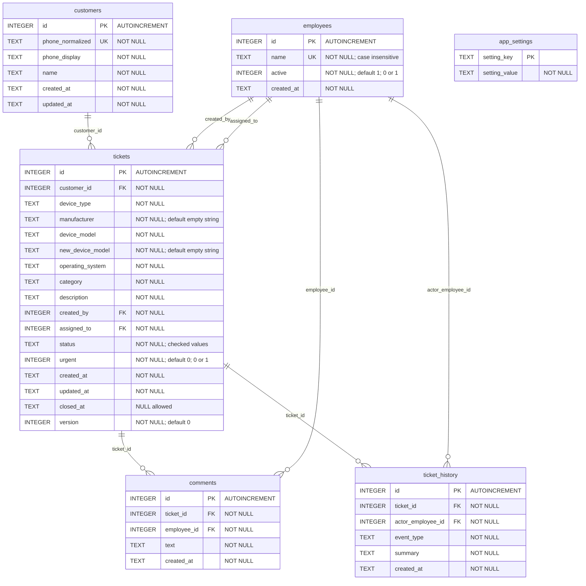
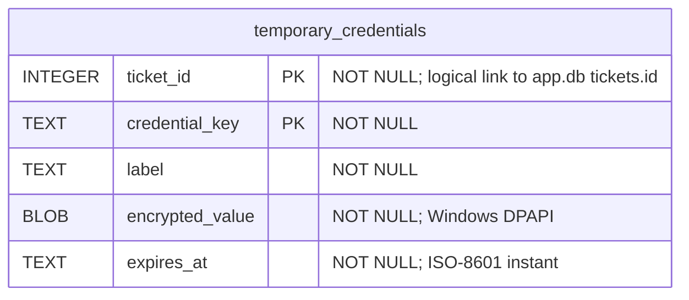

# Telefonhjelp database schema

This map describes the schema defined by the current application source. SQLite stores ordinary case data in `app.db` and temporary credentials in a separate `secrets.db`, under `%LOCALAPPDATA%\PhoneSupport` by default.

## Main database: `app.db`

Each relationship below links one parent row to zero or more child rows. Every child foreign key is required. `PK` means primary key, `FK` means foreign key, and `UK` means unique key.

| Table | Purpose |
| --- | --- |
| `employees` | Staff names and active/inactive state. |
| `customers` | Customer identity, matched by unique normalized phone number. |
| `tickets` | Device, problem, assignment, status, timestamps, and optimistic concurrency version. |
| `comments` | Notes written by employees on cases. |
| `ticket_history` | Audit events, including each resolution note. |
| `app_settings` | Text key/value settings; `current_employee` stores the selected employee ID as text, without a foreign key. |

### Constraints and application values

- `tickets.status` has a SQL check allowing `IN_PROGRESS`, `WAITING`, `ESCALATED`, and `CLOSED`.
- `employees.active` and `tickets.urgent` have SQL checks allowing only `0` and `1`.
- `employees.name` is unique with `COLLATE NOCASE`; `customers.phone_normalized` is unique.
- Device types are application enum values: `PHONE`, `TABLET`, `SMARTWATCH`, `COMPUTER`, and `OTHER`. Operating systems are `IOS`, `ANDROID`, and `OTHER`. These columns have no SQL enum/check constraint.
- Timestamps are stored as text containing ISO-8601 instants. The SQL schema does not validate their format.
- Foreign keys have no cascading delete or update clauses.
- `app_settings.setting_key` is declared `TEXT PRIMARY KEY` without an explicit `NOT NULL`, matching the migration exactly.

### Customer history and resolution notes

Customer history follows `customers.id → tickets.customer_id`. The application finds the customer by exact normalized phone number and lists their cases newest first, excluding the currently viewed case when requested.

There is no `resolution_note` column or separate resolution table. Closing a case records a `ticket_history` row with `event_type = 'RESOLUTION'` and the note in `summary`, in the same transaction as the status change. The API's `resolutionNote` field is derived from the latest such row by history ID. Reopening preserves earlier resolution events.

### Explicit indexes

| Index | Table | Columns, in order |
| --- | --- | --- |
| `idx_tickets_status_created` | `tickets` | `status`, `created_at` |
| `idx_tickets_assigned` | `tickets` | `assigned_to` |
| `idx_tickets_category` | `tickets` | `category` |
| `idx_comments_ticket` | `comments` | `ticket_id`, `created_at` |
| `idx_history_ticket` | `ticket_history` | `ticket_id`, `created_at` |

SQLite also supplies indexes for the declared unique constraints and text/composite primary keys. Integer primary keys identify the table row directly.

## Temporary credential database: `secrets.db`

The primary key is the pair `(ticket_id, credential_key)`. A ticket can have multiple credential fields, each with its own expiration time. `ticket_id` is an application-level association across database files, **not a declared SQL foreign key**.

Credential values are encrypted with Windows DPAPI and expire 24 hours after the field is saved. Expired rows are removed on startup, on relevant access, and periodically while the app is running. Temporary credentials are excluded from the application's ticket database backups and reports.

## Infrastructure and source files

Flyway manages its own `flyway_schema_history` metadata table in `app.db`. SQLite maintains `sqlite_sequence` for autoincrement IDs. These infrastructure tables are omitted from the application relationship diagram.

The PIN is stored outside SQL in `pin-access.dat`, with `pin-access.initialized` marking completed setup.

- [V1: tables and indexes](../src/main/resources/db/migration/V1__initial_schema.sql)
- [V2: new device model column](../src/main/resources/db/migration/V2__add_new_device_model.sql)
- [V3: demo data only, no schema changes](../src/main/resources/db/migration/V3__add_demo_report_data.sql)
- [Temporary credential table and expiry](../src/main/java/no/telefonhjelp/service/SecretService.java)
- [Customer history and derived resolution notes](../src/main/java/no/telefonhjelp/service/TicketService.java)
- [Database connection and migration setup](../src/main/java/no/telefonhjelp/config/DatabaseConfig.java)
- [PIN storage](../src/main/java/no/telefonhjelp/security/PinAccess.java)
